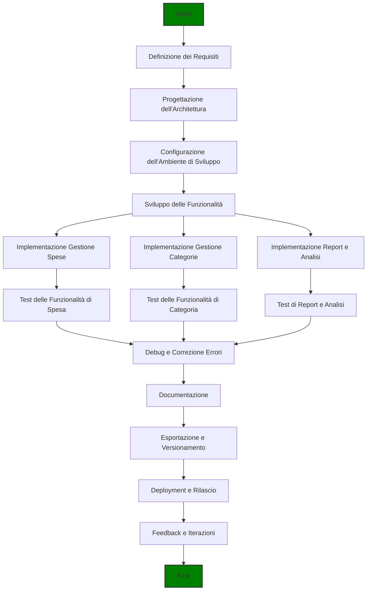
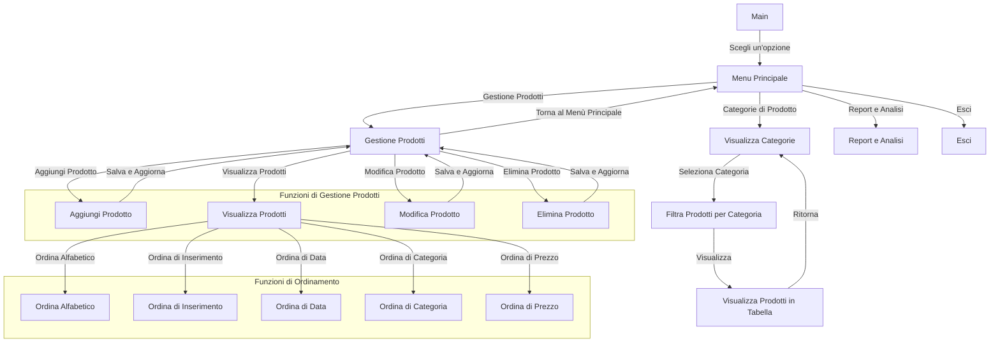

# Gestionale delle Spese Aziendali

## Descrizione

Il **Gestionale delle Spese Aziendali** è un'applicazione console sviluppata in C# progettata per aiutare le aziende a tracciare, gestire e analizzare le spese aziendali. L'applicazione consente di registrare le spese, gestire le categorie e generare report in formato CSV per facilitare l'analisi finanziaria e la contabilità.

## Target

- I **contabili** e i **professionisti della contabilità** sono il target che probabilmente trarrà il massimo vantaggio dal _Gestionale delle Spese Aziendali_ grazie alla sua capacità di gestire e analizzare le spese in modo dettagliato.
- **Manager e Responsabili Finanziari**: Anche se il loro utilizzo potrebbe essere più orientato verso la visualizzazione e l'analisi dei dati piuttosto che la gestione quotidiana. Tuttavia, l'analisi dei report generati dal software sarà comunque utile per loro.

## Funzionalità

### Gestione Spese

- [x] **Aggiungi Nuove Spese**: Registra nuove spese con dettagli come data, importo, categoria e descrizione.
- [x] **Modifica e Elimina Spese**: Aggiorna o rimuovi spese esistenti.
- [x] **Visualizza Riepilogo**: Consulta un riepilogo dettagliato delle spese registrate.
- [ ] **Ordinamento Visualizzazione**: Ordinamento della visualizzazione delle spese registrate in ordine alfabetico, di data, di inserimento, di categoria, di prezzo (alto - basso / basso - alto).

### Categorie di Spesa

- [ ] **Gestione Categorie**: Crea e gestisci categorie di spesa personalizzate.
- [ ] **Assegna Categorie**: Collega i prodotti alle categorie appropriate per una gestione più organizzata.

### Report e Analisi

- [ ] **Esporta in CSV**: Genera file CSV contenenti i dettagli delle spese per analisi finanziaria e contabilità.
- [ ] **Creazione di Grafici**: Analizza le spese attraverso grafici incorporati nel file CSV (in fase di valutazione).

### Funzionalità Future

- [ ] **Gestione degli Utenti**: Implementa registrazione e login degli utenti con ruoli e permessi.
- [ ] **Gestione Spese Carte di Credito Aziendali**: Monitoraggio delle spese effettuate tramite carte di credito aziendali.
- [ ] **Monitoraggio Spese Viaggi e Vitto**: Gestisci le spese relative a viaggi e vitto.
- [ ] **Gestione Spese per Progetti**: Assegna e monitorizza spese specifiche per progetti.
- [ ] **Analisi Finanziaria**: Analisi complessiva del fatturato, utili e perdite.
- [ ] **Budget e Avvisi**: Imposta e monitora budget per categorie con notifiche sui superamenti.
- [ ] **Gestione Multi-Valuta**: Gestisci spese in diverse valute e esegui conversioni tra valute.
- [ ] **Persistenza dei Dati**: Implementazione della persistenza dei dati usando JSON e supporto per database.

## Architettura del Progetto

