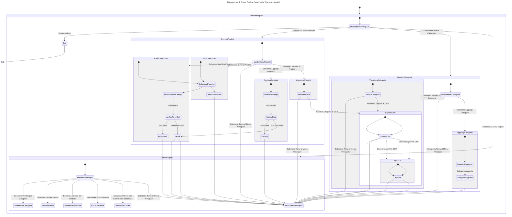

# Gestionale delle Spese Aziendali

## Utili
Gli oggetti di tipo ***anonimo*** in C# sono, per loro natura, **immutabili.** Una volta creati, i loro valori non possono essere modificati. Questo è un comportamento intenzionale e progettato per garantire l'integrità dei dati e prevenire errori di programmazione comuni.

### Perché gli oggetti anonimi sono immutabili?

   - **Sicurezza:** L'immutabilità aiuta a prevenire modifiche accidentali ai dati, rendendo il codice più sicuro e affidabile.
   - **Prestazioni:** Gli oggetti immutabili possono essere ottimizzati dal compilatore, portando a un codice più veloce.
   - **Thread safety:** Gli oggetti immutabili sono intrinsecamente thread-safe, poiché non possono essere modificati da più thread contemporaneamente.

### Cosa fare se hai bisogno di modificare i dati:

   - **Crea un nuovo oggetto:** Ogni volta che vuoi apportare una modifica, crea un nuovo oggetto anonimo con i valori aggiornati.
   - **Utilizza una classe:** Se hai bisogno di modificare frequentemente i dati, definisci una classe con proprietà modificabili. Questa è generalmente la soluzione preferita quando si lavora con dati che richiedono aggiornamenti frequenti.
   - **Utilizza un dizionario:** Un dizionario (come Dictionary<string, object>) può essere utile per rappresentare dati dinamici che possono cambiare nel tempo.

### **Come accedere agli elementi:**

   - **Indice:** Come con qualsiasi lista, puoi accedere a un elemento utilizzando il suo indice numerico, partendo da 0.
   - **Ciclo foreach:** Per iterare su tutti gli elementi della lista, puoi utilizzare un ciclo foreach.

Esempio:

```C#
List<dynamic> miaLista = new List<dynamic>();
miaLista.Add("Ciao");
miaLista.Add(42);
miaLista.Add(new { Nome = "Marco", Età = 30 });

// Accedere al primo elemento (una stringa)
string saluto = miaLista[0];
Console.WriteLine(saluto); // Output: Ciao

// Iterare su tutti gli elementi
foreach (dynamic elemento in miaLista)
{
    Console.WriteLine(elemento);
}
```


### **Attenzione al tipo:**

   - **Cast esplicito:** Poiché gli elementi in una List<dynamic> possono essere di qualsiasi tipo, dovrai spesso eseguire un cast esplicito per accedere alle proprietà o ai metodi specifici di un oggetto.
   - **Operatori is e as:** Puoi utilizzare gli operatori is e as per verificare il tipo di un oggetto prima di eseguire un cast.

### **Esempio con cast:**
```C#
dynamic persona = miaLista[2];
if (persona is dynamic { Nome: string nome, Età: int eta })
{
    Console.WriteLine($"Il nome è {nome} e l'età è {eta}");
}
```

### **Cosa ricordare:**

  - **Nessuna garanzia di tipo:** Poiché il tipo degli elementi non è noto in fase di compilazione, potresti incorrere in errori a runtime se provi ad accedere a proprietà o metodi che non esistono per un determinato oggetto.
  - **Performance:** L'utilizzo di dynamic può comportare una leggera penalizzazione in termini di prestazioni rispetto all'utilizzo di una lista con un tipo specifico.

### **Quando usare con cautela:**

  - **Codice critico:** Evita di utilizzare List<dynamic> in parti di codice dove le prestazioni sono cruciali o dove la sicurezza è fondamentale.
  - **Codice complesso:** Se il tuo codice diventa troppo complesso a causa dell'uso di dynamic, considera di utilizzare una struttura dati più specifica o di introdurre un'interfaccia comune per gli oggetti nella lista.

## Descrizione del Codice

Questo programma è un gestionale per prodotti aziendali che consente di gestire e visualizzare prodotti e categorie, generare report e analisi, e esportare i dati in formato CSV. Utilizza le librerie Newtonsoft.Json per la manipolazione dei dati JSON e Spectre.Console per l'interfaccia a riga di comando interattiva.

# Dettagli del Codice
## 1) Importazioni
Il programma inizia con l'importazione delle librerie necessarie e la definizione della classe Program contenente il metodo Main.

```csharp
using Newtonsoft.Json;
using Spectre.Console;
using System.Diagnostics;
```

## 2) Main Method
Il punto di ingresso del programma è il metodo Main. Qui vengono caricati i dati dei prodotti e delle categorie dai file JSON e viene presentato un menu principale per la navigazione.

```csharp
static void Main(string[] args)
{
    // Stampa il titolo dell'applicazione
    AnsiConsole.MarkupLine("[bold green]Gestionale delle Prodotti Aziendali[/]");

    // Percorsi dei file JSON
    string pathProdotti = @"GestioneProdotti.json";
    string pathCategorie = @"Categorie.json";

    // Carica i dati
    List<dynamic> Prodotti = CaricaProdotti(pathProdotti);
    List<string> Categorie = CaricaCategorie(pathCategorie);

    // Menu principale
    while (true)
    {
        var menu = AnsiConsole.Prompt(
            new SelectionPrompt<string>()
                .Title("Scegli un'opzione:")
                .AddChoices("Gestione Prodotti", "Categorie di Prodotto", "Report e Analisi", "Ricerca Prodotto", "Esci"));

        // Switch case per gestire le scelte del menu
        switch (menu)
        {
            case "Gestione Prodotti":
                GestioneProdotti(Prodotti, Categorie, pathProdotti, pathCategorie);
                break;

            case "Categorie di Prodotto":
                VisualizzaCategorie(Prodotti, Categorie);
                break;

            case "Report e Analisi":
                VisualizzaReport(Prodotti);
                break;

            case "Ricerca Prodotto":
                RicercaProdotti(Prodotti);
                break;

            case "Esci":
                return;
        }
    }
}

```

## 3) Caricamento dei Dati
I metodi CaricaProdotti e CaricaCategorie leggono i dati da file JSON e li deserializzano in liste di oggetti dinamici e stringhe.

```csharp
static List<dynamic> CaricaProdotti(string path) { ... }
static List<string> CaricaCategorie(string path) { ... }

```

## 4) Gestione Prodotti
Il metodo GestioneProdotti offre opzioni per aggiungere, visualizzare, modificare ed eliminare prodotti.

```csharp
static void GestioneProdotti(List<dynamic> Prodotti, List<string> Categorie, string pathProdotti, string pathCategorie) { ... }
```
### Aggiunta di Prodotti
```csharp
static void AggiungiProdotto(List<dynamic> Prodotti, List<string> Categorie, string pathProdotti, string pathCategorie) { ... }

```
### Visualizzazione Prodotti
Permette di ordinare i prodotti in base a diversi criteri e di esportarli in formato CSV.
```csharp
static void VisualizzaProdotti(List<dynamic> Prodotti) { ... }
static void VisualizzaProdottiInTabella(List<dynamic> prodottiOrdinati) { ... }
static void EsportaCsvProd(List<dynamic> ProdottiOrdinati) { ... }
```
### Modifica ed Eliminazione
Consente di modificare o eliminare prodotti esistenti, aggiornando di conseguenza i file JSON.
```csharp
static void ModificaProdotto(List<dynamic> Prodotti, List<string> Categorie, string pathProdotti, string pathCategorie) { ... }
static void EliminaProdotto(List<dynamic> Prodotti, List<string> Categorie, string pathProdotti, string pathCategorie) { ... }
```
## 5) Gestione Categorie
Visualizza le categorie dei prodotti e consente la selezione e l'esportazione dei dati.
```csharp
static void VisualizzaCategorie(List<dynamic> Prodotti, List<string> Categorie) { ... }
```
## 6) Report e Analisi
Genera report su vendite mensili, per prodotto, fasce di prezzo e giorni della settimana.
```csharp
static void ReportVenditeMese(List<dynamic> Prodotti) { ... }
static void ReportVenditeProdotto(List<dynamic> Prodotti) { ... }
static void ReportVenditeFascePrezzo(List<dynamic> Prodotti) { ... }
static void ReportVenditeGiorni(List<dynamic> Prodotti) { ... }
```
## 7) Ricerca Prodotti
Funzionalità per la ricerca di prodotti specifici basati su criteri inseriti dall'utente.
```csharp
static void RicercaProdotti(List<dynamic> Prodotti) { ... }
```


## 8) Utilità Grafiche
Disegna grafici a barre per la visualizzazione dei dati.
```csharp
static void DisegnaGraficoBarre(string titolo, Dictionary<string, decimal> dati) { ... }

```

# To-Do List

- [ ] **Autenticazione Utente:**
  - Implementare un sistema di autenticazione per limitare l'accesso a utenti autorizzati. (implementazione futura)

- [ ] **Gestione Magazzino:**
  - Aggiungere funzionalità per gestire l'inventario del magazzino, includendo scorte e riordino.

- [ ] **Analisi Avanzate:**
  - Sviluppare report più avanzati come l'analisi delle tendenze di vendita e previsioni.

- [ ] **Backup e Ripristino:**
  - Aggiungere funzionalità per il backup e il ripristino dei dati in caso di errori o perdite di dati.

- [ ] **Rimuovere Ridondanze:**
  - Trovare e rimuovere eventualemente ove possibile tutte le ridonzanze del codice per accorciarlo.

- [ ] **Gestione degli Errori:**
  - Implementa una gestione degli errori robusta per evitare che l'applicazione si blocchi in caso di errori imprevisti.

- [ ] **Aggiunta Quantità:**
  - Implementa una gestione delle quantità dei prodotti disponibili.

- [ ] **Aggiunta Cliente e ordini:**
  - Implementa una gestione della ventita di uno o piu prodotti ad un cliente con le specifiche del nome categoria data e data ordine per poterlo implementare nel KPI.

- [ ] **Aggiunta Quantità:**
  - Implementa un'analisi del KPI per visualizare le vendite e le possibilità di crescità.

## Architettura del Progetto


